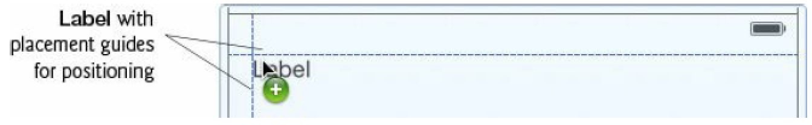

[toc]

## 3. Tip Calculator App


本章目标：

- 利用 `NSDecimalNumber` 进行精确的金额计算。
- Create locale-specific currency and percentage Strings with `NSNumberFormatter`.
- Use Text Fields and Sliders to receive user input.
- Programmatically manipulate UI components via **outlets**.
- Respond to user-interface events with **actions**.
- Understand the basics of automatic reference counting (ARC).

### 3.1 介绍

计算小费和总的费用。每次输入数字立即计算。

### 3.2 Technologies Overview

Reference-Type Objects That Are Assigned to Constants Are Not Constant Objects. Initializing a constant (declared with let) with a reference-type object simply means that the constant always refers to the same object. You can still use a reference-type constant to access read/write properties and to call methods that modify the referenced object.

代码提示：You can press the Esc key to close the suggestion list and **press it again to reopen the list**.

#### 3.2.2 Swift Apps and the Cocoa Touch® Frameworks

**Foundation Framework**
本章使用 Foundation 的 `NSDecimalNumber` 和 `NSNumberFormatter`。Foundation’s class names begin with the prefix NS, because this framework originated in the NextStep operating system.

List of Cocoa Touch frameworks.


#### 3.2.3 Using the UIKit and Foundation Frameworks in Swift Code

To use UIKit framework classes (or classes from any other existing framework), you must **import** the framework into each source-code file that uses it (as we do in Section 3.6.1). This exposes the framework’s capabilities so that you can access them in Swift code. In addition to UIKit framework UI components, this app also uses various classes from the Foundation framework, such as NSDecimalNumber and NSNumberFormatter. We do not import the Foundation framework—its features are available to your code because the UIKit framework indirectly imports the Foundation framework.

#### 3.2.6 Linking UI Components to Your Swift Code

**@IBOutlet Properties**

Each property for programmatically interacting with a UI component is prefixed with `@IBOutlet`. This tells Interface Builder that the property is an **outlet**. You’ll use Interface Builder to connect a UI control to its corresponding outlet in the view controller using drag-and-drop techniques. Once connected, the view controller can manipulate the corresponding UI component programmatically. `@IBOutlet` properties are variable properties so they can be modified to refer to the UI controls when the storyboard creates them.

**Action Methods**

When you interact with a UI component (e.g., touching a Slider or entering text in a Text Field), a user-interface event occurs. The view controller handles the event with an action—an event-handling method that specifies what to do when the event occurs. Each action is annotated with `@IBAction` in your view controller’s class. `@IBAction` indicates to Interface Builder that a method can respond to user interactions with UI components. You’ll use Interface Builder to visually connect an action to a specific user-interface event using drag-and-drop techniques.

#### 3.2.7 Performing Tasks After a View Loads

For example, in this app, you’ll call the method `becomeFirstResponder` on the `UITextField` to make it the active component—as if the user touched it.

Calling `becomeFirstResponder` from `viewDidLoad` causes iOS to display the keypad immediately after the view loads.

iOS’s **responder chain** defines the order in which components are notified that an event occurred. For the complete responder chain details, visit:
http://bit.ly/iOSResponderChain

### 3.3 Building the App’s UI

#### 3.3.1 创建工程

Begin by creating a new Single View Application iOS project. Product Name: TipCalculator. **Devices: iPhone**—This app is designed for iPhones and iPod touches. The app will run on iPads, but it will fill most of the screen and be centered, 如下图：


Tip Calculator running in the iPad Air simulator.

**配置应用只支持竖屏**。横屏模式下，数字键盘将遮盖部分UI。

#### 3.3.2 配置 Size Classes，设计一个竖握的 iPhone 应用

In Chapter 2, we designed a UI that supported both portrait and landscape orientations for any iOS device. For that purpose, we used the default size class **Any** for the design area’s width and height. In this section, you’ll configure the design area (also called the canvas) for a tall narrow device, such as an iPhone or iPod touch in portrait orientation. Select Main.storyboard to display the design area—also known as the canvas.

At the bottom of the canvas, click the **Size Classes** control to display the size classes tool, then click in the lower-left corner to specify the size classes **Compact Width and Regular Height** (Fig. 3.8).


### 3.3.3 添加UI组件

In this section, you’ll add and arrange the UI components to create the basic design. In Section 3.3.4, you’ll add auto layout constraints to complete the design.

**Step 1: Adding the “Bill Amount” Label**

拖一个 Label，放在场景的左上角，利用蓝色的参考线将其放置在场景左上角推荐的位置。双击标签，输入 **Bill Amount**。



**Step 2: 添加一个标签，显示格式化后的用户输入**

拖一个 Label，放在 “Bill Amount” 标签下。This is where the user input will be displayed.


Drag the middle sizing handle at the new Label’s right side until the blue guide line at the scene’s right side appears.


In the Attributes inspector, scroll to the **View** section and locate the Label’s **Background** attribute. Click the attribute’s value, then select Other... to display the Colors dialog. On the bottom row, select the Sky (blue) crayon as the color, then set the **Opacity** to 50%.


标签的默认高度是21点。We increased this Label’s height to add space above and below its text to make it more readable against the colored background. To do so, drag the bottom-center sizing handle down until the Label’s height is 30.


删除标签的内容。

**Step 3: 添加 “Custom Tip Percentage:” 标签，和显示当前百分比的标签**

在蓝色标签下新添加一个标签。双击，`Custom Tip Percentage:`。


“Custom Tip Percentage:” 右边添加一个标签。将其内容设为 `18%`。


**Step 4: Custom Tip Percentage 滑块**

创建滑块。拖一个 Slider，如下图：


用 Attributes inspector 设置滑块最小值0，最大值30，当前值18。

**Step 5: Adding the “15%” and “18%” Labels**

Next, you’ll add two more Labels containing the text 15% and 18% to serve as column headings for the calculation results. The app will update the “18%” Label when the user moves the Slider’s thumb. Initially, you’ll position these Labels approximately — later you’ll position them more precisely.

Drag another Label onto the scene and use the blue guides to position it the recommended distance below the Slider (Fig. 3.19), then set its Text to 15% and its Alignment to centered.

复制 “15%” 标签，按住 option 键拖 “15%” 标签到右边。You can also duplicate a UI component by selecting it and typing + D, then moving the copy. 将标签文件修改为 18%。


**Step 6: Creating the Labels That Display the Tips and Totals**

Next, you’ll add four Labels in which the app will display the calculation results:

Drag a Label onto the UI until the blue guides appear as in Fig. 3.21.


Drag the Label’s bottom-center sizing handle until the Label’s Height is 30, and drag its leftcenter sizing handle until the Label’s Width is 156.

Use the Attributes inspector to clear the Text attribute, set the Alignment so the text is centered and set the Background color to Banana, which is located in the Color dialog’s Crayons tab in the second row from the bottom.

Set the Autoshrink property to Minimum Font Scale and change the value to .75—if the text becomes too wide to fit in the Label, this will allow the text to shrink to 75% of its original font size to accommodate more text. If you’d like the text to be able to shrink even more, you can choose a smaller value.

Next duplicate the yellow Label by holding the option key and dragging the Label to the left to create another Label below the “15%” Label.

Select both yellow Labels by holding the Shift key and clicking each Label. Hold the option key and drag any one of the selected Labels down until the blue guides appear as shown in Fig. 3.22.


Now you can center the “15%” and “18%” Labels over their columns. Drag the “Tip” Label so that the blue guide lines appear as shown in Fig. 3.23. Repeat this for the “18%” Label to center it over the right column of yellow Labels.


**Step 7: Creating the “Tip” and “Total” Labels to the Left of the Yellow Labels**

Drag a Label onto the scene, change its Text to `Total`, set its Alignment to right aligned and position it to the left of the second row of yellow Labels as in Fig.3.24.


Hold the option key and drag the “Total” Label up until the blue guides appear as shown in Fig.3.25. Change the new Label’s text to `Tip`, then drag it to the right so that the right edges of the “Tip” and “Total” Labels align.

**Step 8: Creating the Text Field for Receiving User Input**

You’ll now create the Text Field that will receive the user input. Drag a Text Field to the bottom edge of the scene, then use the Attributes inspector to set its Keyboard Type attribute to **Number Pad** and its **Appearance** to Dark. This Text Field will be hidden behind the numeric keypad when the app first loads. You’ll receive the user’s input through this Text Field, then format and display it in the blue Label at the top of the scene.

#### 3.3.4 Adding the Auto Layout Constraints

目前尚未使用任何自动布局约束，在某些设备上可能有显示问题，如下图：


**Step 1: 添加 Missing Auto Layout Constraints**

Click the white background in the design area or select View in the document outline window. At the bottom of the canvas, click the **Resolve Auto Layout Issues** button and under **All Views in View Controller** select **Add Missing Constraints**. Interface Builder analyzes the UI
components in the design and based on their sizes, locations and alignment, then creates a set of auto layout constraints for you.

Figure 3.27 shows the UI in the iPhone 5s simulator after Interface Builder adds the missing constraints. Now, all of the UI components are completely visible, but some of them are not sized and positioned correctly. In particular, the yellow Labels should all be the same width.


**Step 2: 设置黄色标签宽度相同**

选中所有四个黄色标签。选择自动布局的 Pin 按钮，选中 **Equal Widths**。

现在的效果是，右上的的 18% 标签不见了，左边一列 “Tip” 和 “Total” 显示不全。


**Step 3: Debugging the Missing “18%” Label**

Based on the initial design, the missing “18%” Label should be centered over the right column of yellow Labels. If you select that Label in the canvas and select the Size inspector in the Utilities area, you can see the missing Label’s complete set of constraints (Fig. 3.30).


“18%”标签在水平方向上有两个约束：

- The Trailing Space to: Superview constraint specifies that this Label should be 60 points from the scene’s trailing edge.
- The Align Center X to: Label constraint specifies that this Label should be centered horizontally over the specified Label.

两个约束相互冲突。By removing the Trailing Space to: Superview constraint, we can eliminate the conflict. To do so, simply click that constraint in the **Size inspector** and press the delete key. Figure 3.31 shows the final UI in the iPhone 5s simulator, but you can test the UI in other simulators to confirm that it works correctly in each.


### 3.4 Creating Outlets with Interface Builder

You’ll now use Interface Builder to create the outlets for the UI components that the app interacts with programmatically. Figure 3.32 shows the outlet names that we specified when creating this app. A common naming convention is to use the UI component’s class name without the UI class prefix at the end of an outlet property’s name — for example, `billAmountLabel` rather than `billAmountUILabel`. (At the time of this writing, Apple had not yet published their Swift coding guidelines.) Interface Builder makes it easy for you to create outlets for UI components by control dragging from the component into your source code. To do this, you’ll take advantage of the Xcode Assistant editor.


例子：

```
@IBOutlet weak var billAmountLabel: UILabel!
```


### 3.5 Creating Actions with Interface Builder

A Text Field’s **Editing Changed** event occurs every time the user changes the Text Field’s contents. Similarly, the **Value Changed** event repeatedly occurs for a Slider as the user moves the thumb.

In this app, you’ll create one action method that’s called for each of these events.

In the popover, specify `calculateTip` for the action’s Name, select **Editing Changed** for the Event and click Connect.

Xcode inserts the following empty method definition in the code:

```
@IBAction func calculateTip(sender: AnyObject) {
}
```

Recall that `calculateTip` should also be called as the user changes the custom tip percentage. You can simply connect the Slider to this **existing** action to handle the Slider’s **Value Changed** event. To do so, select the Slider in the scene, then hold the control key and drag from the Slider to the `calculateTip:` method and release. This connects the Slider’s Value Changed event to the action. You’re now ready to implement the app’s logic.

### 3.6 Class ViewController

#### 3.6.4 其他 ViewController 属性

```
// NSDecimalNumber constants used in the calculateTip method
let decimal100 = NSDecimalNumber(string: "100.0")
let decimal15Percent = NSDecimalNumber(string: "0.15")
```

#### 3.6.5 覆盖 `viewDidLoad` 方法

```
override func viewDidLoad() {
	super.viewDidLoad()
    // select inputTextField so keypad displays when the view loads
    inputTextField.becomeFirstResponder()
}
```

#### 3.6.6 ViewController Action Method `calculateTip`

```
// called when the user edits the text in the inputTextField
// or moves the customTipPercentageSlider's thumb
@IBAction func calculateTip(sender: AnyObject) {
	let inputString = inputTextField.text // get user input
    // convert slider value to an NSDecimalNumber
    let sliderValue = NSDecimalNumber(Int(customTipPercentageSlider.value
    // divide sliderValue by decimal100 (100.0) to get tip %
    let customPercent = sliderValue / decimal100
    // did customTipPercentageSlider generate the event?
    if sender is UISlider {
    	// thumb moved so update the Labels with new custom percent
        customTipPercentLabel1.= NSNumberFormatter.numberStyle: NSNumberFormatterStyle.PercentStyle customTipPercentLabel2.= customTipPercentLabel1.text
	}
    // if there is a bill amount, calculate tips and totals
    if !inputString.isEmpty {
    	// convert to NSDecimalNumber and insert decimal point
        let billAmount = NSDecimalNumber(inputString) / decimal100
        // did inputTextField generate the event?
        if sender is UITextField {
        	// update billAmountLabel with currency-formatted total
            billAmountLabel.= " " + formatAsCurrency(billAmount)
            // calculate and display the 15% tip and total
            let fifteenTip = billAmount * decimal15Percent
            tip15Label.= formatAsCurrency(fifteenTip)
            total15Label.= formatAsCurrency(+ fifteenTip)
        }
        // calculate custom tip and display custom tip and total
        let customTip = billAmount * customPercent
        tipCustomLabel.= formatAsCurrency(customTip)
        totalCustomLabel.= formatAsCurrency(+ customTip)
    } else {
        // clear all Labels
    	billAmountLabel.= ""
        tip15Label.text = ""
        total15Label.= ""
        tipCustomLabel.= ""
        totalCustomLabel. = ""
    }
}
}
```
