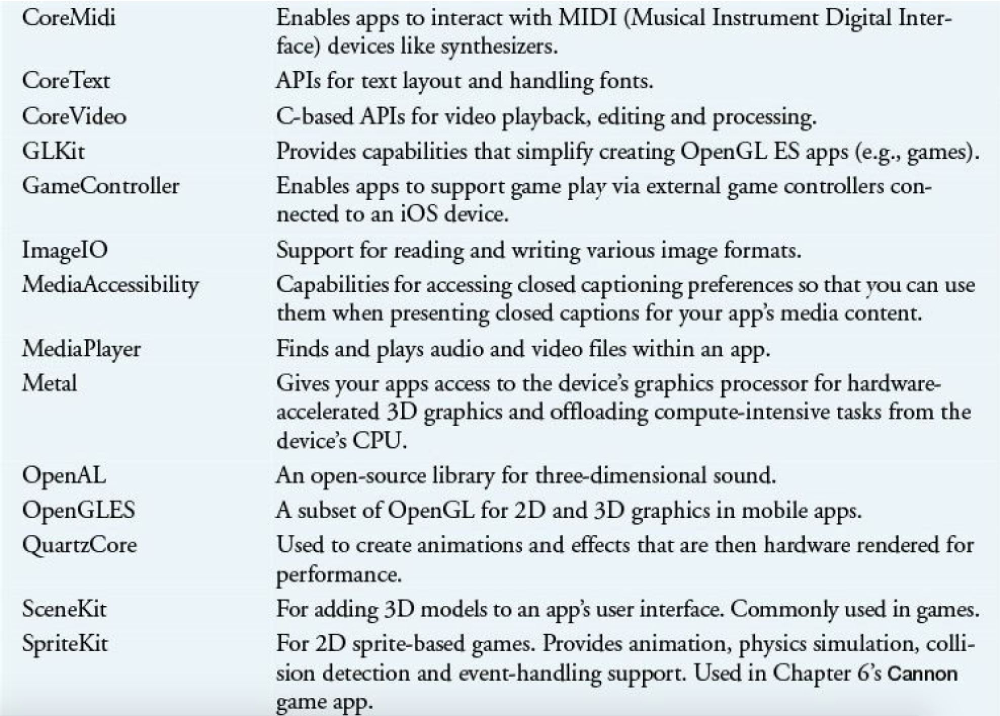

[toc]

本书所有应用都是 Swift 编写的。

## 前言

Welcome to the world of iOS® 8 app development with Apple’s new and
rapidly evolving Swift™ programming language, the Cocoa Touch® frameworks
and the Xcode® 6 development tools.

源码：http://www.deitel.com/books/iOS8FP1

Swift基础：Swift for Programmers print book (www.deitel.com/books/swiftfp

本书例子使用Swift。

**Cocoa Touch Frameworks**. Cocoa Touch is the groups of reusable components (known as frameworks) for building iOS apps.

**iOS SDK 8**.

**iOS Human Interface Guidelines**. We encourage you to read Apple’s iOS
Human Interface Guidelines (HIG) and follow them as you design and develop your apps.

## 1. iOS 8 应用开发和 Swift 介绍

https://developer.apple.com/library/UserExperience/Conceptual/iPhoneAccessibility/Introduction.html

### 1.3 手势

### 1.4 传感器

- 加速度计
- 三轴陀螺仪
- 数字罗盘
- 环境光传感器，调整屏幕亮度等
- 距离传感器，判定设备是否靠近脸部，靠近时关闭屏幕。
- The iPad magnetic sensor determines whether an iPad smart cover—which is attached to the device magnetically and covers the screen—is open or closed, and turns the screen on or off, respectively.
- GPS
- Touch ID（指纹）传感器
- NFC传感器（iphone 6）。目前只用于苹果支付服务。

### 1.7 iOS操作系统历史

iOS 4 also added several developer frameworks for integrating some of the core functionality of the device into your apps. For example, the Event Kit framework is used to access events in the Calendar app and the Core Motion framework replaced and enhanced earlier iOS capabilities for reading a device’s motion data from sensors such as the accelerometer, gyroscope and magnetometer, which we discuss in Section 1.4. iOS 4 also added Grand Central Dispatch (GCD), which provided a new asynchronous programming model that was more efficient than the traditional multithreading model provided in earlier iOS versions. Figure 1.4 lists some key iOS 4 features.

### 1.11 Objective-C

NeXT also developed Interface Builder for creating graphical user interfaces with drag-and-drop.

### 1.12 Swift

性能更高。Swift was designed for better performance than Objective-C on today’s multi-core systems. At Apple’s WWDC 2014 main keynote address, Apple observed that Swift code was about 1.5 times faster than Objective-C code. 景观 Array, String 和 Dictionary 是值类型，变量赋值或传递时需要拷贝，但 Swift 编译器会优化值类型的拷贝操作，仅在需要的时候拷贝。

Swift没有指针。

赋值运算符（`=`）不返回任何值。

控制语句中，括号是可选的，但大括号是必须使用的。

The **Swift Standard Library** contains Swift’s built-in types (String, Array, Dictionary and the various integer and floating-point numeric types), protocols (Equatable, Comparable and Printable) and global functions (e.g., for printing and sorting). For more details on these types, protocols and global functions, see Apple’s Swift Standard Library Reference document at: https://developer.apple.com/library/Reference/SwiftStandardLibraryReference

Swift 与 Objective-C 一样，可以使用 OS X 的 Cocoa 框架和 iOS 的 **Cocoa Touch** 框架。The frameworks are written mainly in Objective-C (some are written in C); Apple has indicated that new frameworks will be developed in Swift. See Section 1.14 for more details on these frameworks.

**桥接**。可以在一个应用中同时使用 Swift 和 Objective-C。多数 Cocoa Touch APIs 仍是 Objective-C 写的，因此 Swift 需要与 Objective-C code 代码交互。实际上，你会经常把 Swift 对象传给 Objective-C 写的方法。Swift 的数值类型，String, Array 和 Dictionary，一般可以用在期望 Objective-C 等价类型的地方。反过来，Objective-C 的等价类型（NSString, NSMutableString, NSArray, NSMutableArray, NSDictionary  和 NSMutableDictionary），从 Objective-C 返回 Swift 代码时，会自动当做 Swift 的等价类型。该机制称为**桥接**；对你是透明的。

Apple’s book **Using Swift with Cocoa and Objective-C**, available at: https://developer.apple.com/library/Conceptual/BuildingCocoaApps

Apple’s Swift Blog is located at:
https://developer.apple.com/

Apple’s book **The Swift Programming Language** introduces Swift and contains a brief tour of the language, the language guide (covering Swift’s key features in more depth) and the language reference (presenting Swift’s grammar and the details of each language feature). This is available in the iBooks store and at:
https://developer.apple.com/Conceptual/Swift_Programming_

Swift 在快速进化。官方表示 Swift 将与未来的版本二进制兼容，但不一定是源码兼容的。Apple plans to provide code converters to help you update your existing Swift source code with new language features.

### 1.14 Cocoa Touch® iOS Frameworks

Cocoa Touch is the version of Cocoa for iOS devices—these are resource constrained. OS X 和 iOS 开发的三个核心框架是 Foundation、AppKit 和 UIKit。

**Foundation Framework**
The Foundation framework—in both Cocoa and Cocoa Touch—includes class `NSObject` for defining object behavior. Foundation also has classes for basic types, storing data, working with text and strings, filesystem access, calculating differences in dates and times, inter-app notifications and much more.
**AppKit Framework**
Cocoa 的 AppKit 框架用于开发 OS X 应用的界面。AppKit 提供控件（如窗口、菜单、按钮、文本框等）、事件处理、手势。It also supports content sharing between services (e.g., e-mail), iCloud integration, printing, accessibility (for users with disabilities), push notifications, graphics and more.
**UIKit Framework**
Cocoa Touch 的 UIKit 框架类似于 AppKit，为 iOS 应用优化。UIKit includes multi-touch interface controls that are appropriate for mobile apps, event handling for motion-based events, event handling for sensors (e.g., proximity, motion, accelerometer, ambient light, gyroscope) and more.

Other Cocoa Touch Frameworks
The Cocoa Touch frameworks allow you to conveniently access iOS features and incorporate them into your apps. The frameworks help you create apps which adhere to iOS’s unique look and feel. Figures 1.14–1.17 list the frameworks and provide brief descriptions of each. To learn more about these frameworks, see the Frameworks section of the iOS Developer Library at
http://developer.apple.com/library/index.html#section=Frameworks

### 1.15 Xcode 6® Integrated Development Environment

