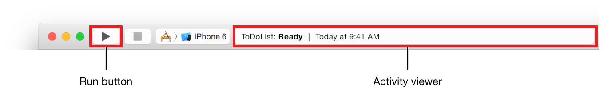
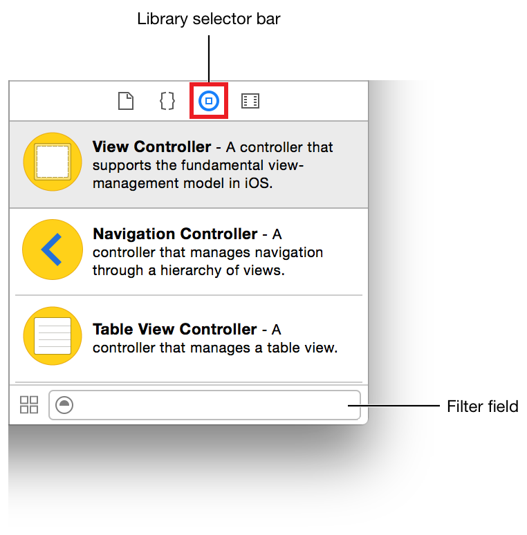
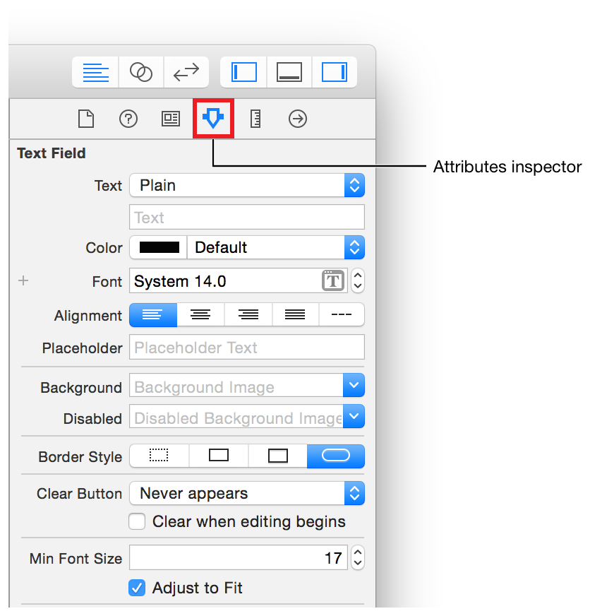
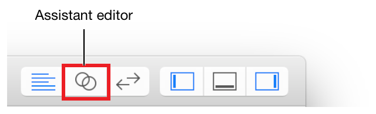
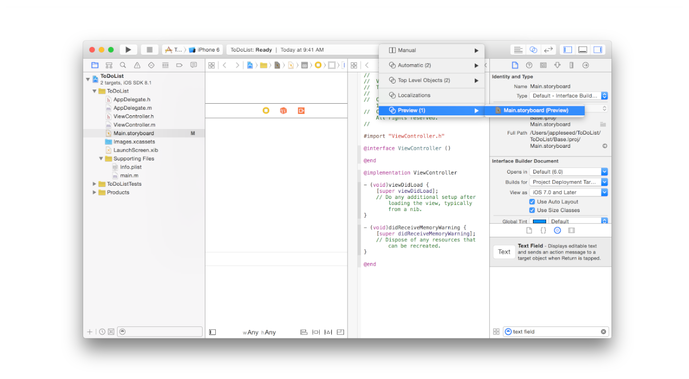
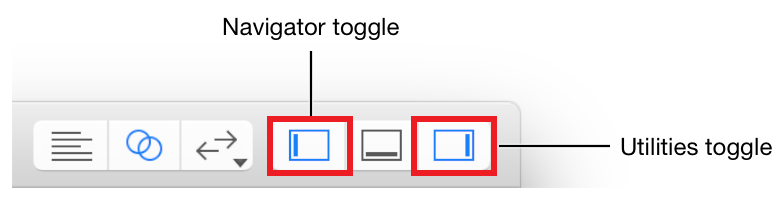
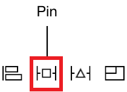
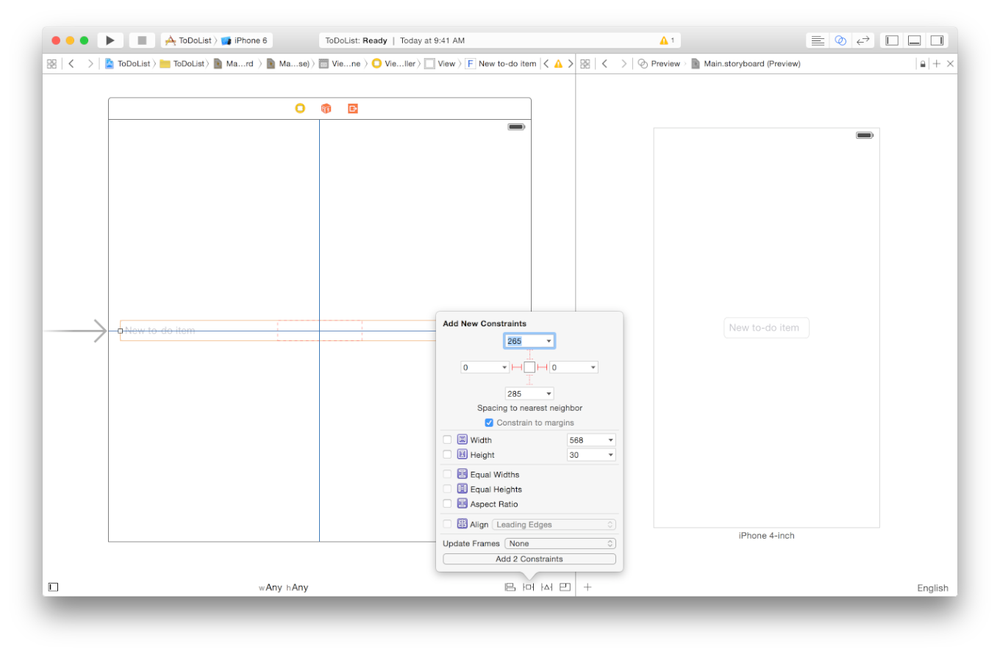
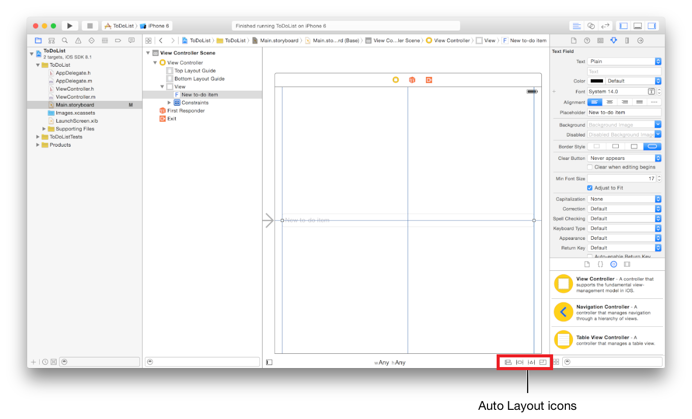

[toc]

https://developer.apple.com/library/ios/referencelibrary/GettingStarted/RoadMapiOS/index.html#//apple_ref/doc/uid/TP40011343

## Start Developing iOS Apps Today

### 介绍

#### Setup

The iOS SDK is included with Xcode.

Objective-C is built on top of the C programming language. You also have access to the standard C library routines, such as those declared in stdlib.h and stdio.h.

**对象通过消息通信**

Although there are several ways to send messages between objects in Objective-C, by far the most common is the basic syntax that uses square brackets. If you have an object somePerson of class XYZPerson, you can send it the sayHello message like this:

```m
[somePerson sayHello];
```

#### Tutorial: Basics

These tutorials use Xcode 6.1.1 and iOS SDK 8.1, so if you’re following along using other software versions, you might notice some differences.

##### 创建工程

Xcode自带一些APP模板。本节使用最简单的模板：Single View Application。

In the welcome window, click “Create a new Xcode project” (or choose File > New > Project).
In the iOS section at the left of the dialog, select Application.
In the main area of the dialog, click Single View Application and then click Next.

完成后会打开一个对话框。

You might notice a warning message that says “No signing identity found.” This warning means you haven’t set up Xcode for iOS development yet, but you can complete the tutorial without doing it. At the end of this document, there’s a link to a guide that helps you set up Xcode to continue iOS development.

##### 运行iOS模拟器

To build and run your app, use the iOS Simulator app that’s included in Xcode.

In this tutorial, use the iPhone 6 option.
Make sure iPhone 6 is selected in the Scheme pop-up menu in the Xcode toolbar.
Click the Run button, located in the top-left corner of the Xcode toolbar.



##### 查看源代码

Most of the work is done by the `UIApplicationMain` function, which is automatically called in your project’s `main.m` source file. The `UIApplicationMain` function creates an application object that sets up the infrastructure for your app to work with the iOS system. This includes creating a run loop that delivers input events to your app.

You won’t be dealing with the `main.m` source file directly, but it’s interesting to understand how it works.

The `main` function in `main.m` calls the `UIApplicationMain` function within an autorelease pool.

```m
int main(int argc, char * argv[]) {
    @autoreleasepool {
    	return UIApplicationMain(argc, argv, nil, NSStringFromClass([AppDelegate class]));
    }
}
```

The `@autoreleasepool` statement supports memory management for your app. Automatic Reference Counting (ARC) makes memory management straightforward by getting the compiler to keep track of who owns an object; `@autoreleasepool` is part of the memory management infrastructure.

`UIApplicationMain`创建应用的两个重要的初始组件：

- `UIApplication`类的实例，称作*application object*。*application object*管理应用的事件循环，and coordinates other high-level app behaviors. `UIApplication`类定义在UIKit framework。
- `AppDelegate`类的实例，称作*app delegate*。使用模板会自动创建这个类。应用代理创建窗口，在其上绘制内容；应用代理响应App状态的变换。与其他类一样，`AppDelegate`类包括两个文件：接口`AppDelegate.h`和实现`AppDelegate.m`。

As your app starts up, the application object calls predefined methods on the app delegate to give your custom code a chance to do its job—that’s when the interesting behavior for an app is executed.

**App Delegate源文件**

应用代理的两个源文件AppDelegate.h和AppDelegate.m。

应用代理接口中包含一个属性：`window`。With this property the app delegate keeps track of the window in which all of your app content is drawn.

Next, view the app delegate implementation file by selecting AppDelegate.m in the project navigator. The app delegate implementation contains “skeletons” of important methods. These predefined methods allow the application object to talk to the app delegate. During a significant runtime event—for example, app launch, low-memory warnings, and app termination—the application object calls the corresponding method in the app delegate, giving it an opportunity to respond appropriately.

Each of these automatically implemented methods has a default behavior. If you leave the skeleton implementation empty or delete it from your AppDelegate.m file, you get the default behavior whenever that method is called. Use these skeletons to put additional custom code that you want to be executed when the methods are called. In this tutorial, you won’t be using any custom app delegate code, so you don’t have to make any changes to the AppDelegate.m file.

##### Open Your Storyboard

A storyboard is a visual representation of the app’s user interface, showing screens of content and the transitions between them. You use storyboards to lay out the flow—or story—that drives your app.

In the project navigator, select Main.storyboard. Xcode opens the storyboard in Interface Builder—its visual interface editor—in the editor area.

At this point, the storyboard in your app contains one *scene*, which represents a screen of content in your app. The arrow that points to the left side of the scene on the canvas is the storyboard *entry point*, which means that this scene is loaded first when the app starts. Right now, the scene that you see on the canvas contains a single view that’s managed by a **view controller**.

When you ran your app in the iPhone 6 iOS Simulator, the view in this scene is what you saw on the device screen. But when you look at the scene on the canvas, you’ll notice that it doesn’t have the exact dimensions of the iPhone 6 screen. This is because the scene on the canvas is a generalized representation of your interface that can apply to any device in any orientation. You use this representation to create an adaptive interface, which is an interface that automatically adjusts so that it looks good in the context of the current device and orientation. You’ll learn how to make your interface adaptive in a little while.

##### 构建基本的接口

It’s time to build the basic interface for the scene that lets you add a new item to the to-do list.

Xcode provides a library of objects that you can add to a storyboard file. Some of these are user interface elements that belong in a view, such as buttons and text fields. Others, such as view controllers and gesture recognizers, define the behavior of your app but don’t appear onscreen.

To be able to add an item to the to-do list, you need a text field.

Open the **Object library**. The Object library appears at the bottom of the utility area. If you don’t see the Object library, click its button, which is the third button from the left in the library selector bar. (Alternatively, display it by choosing View > Utilities > Show Object Library.)



Drag a Text Field object from the Object library to your scene. Drag the text field so that it’s centered vertically and aligned with the left margin in the scene. Drag the text field so that it’s centered vertically and aligned with the left margin in the scene.

With the text field selected, open the Attributes inspector in the utility area.



In the Attributes inspector, find the field labeled Placeholder and type `New to-do item`.

##### 预览接口

You can preview your app interface using the assistant editor, which displays a secondary editor side-by-side with your main one.

Click the Assistant button in the Xcode toolbar to open the assistant editor.



In the editor selector bar, switch the assistant editor from Automatic to Preview.



If you want more space to work, collapse the project navigator and utility area by clicking the Navigator and Utilities buttons in the Xcode toolbar.



As you see, the text field doesn’t look quite right. It extends past the edge of the screen. The interface you specified in your storyboard looks correct, so why is this happening in the iPhone preview? 后面可以学到，你可以构建一个自适应的接口，针对不同尺寸的iPhone缩放。The scene you see by default in your storyboard shows a generalized version of your interface. Here, you’ll need to specify how the interface should adjust for specific devices. You can specify these kinds of interface rules easily using Auto Layout.

##### 使用Auto Layout

Auto Layout is a powerful layout engine that helps you design adaptive layouts with ease. You describe your intent for the positioning of elements in a scene and then let the layout engine determine how best to implement that intent. You describe your intent using constraints—rules that explain where one element should be located relative to another, what size it should be, or which of two elements should shrink first when something reduces the space available for each of them.

The text field in this interface should appear a fixed amount of space from the top of the device screen and stretch to the horizontal margins, regardless of device.

In your storyboard, select the text field. On the canvas, click the Auto Layout Align icon.


Select the checkboxes next to Horizontal Center in Container and Vertical Center in Container. Click the Add 2 Constraints button.

On the canvas, click the Auto Layout Pin icon.



Above “Spacing to nearest neighbor,” select the two horizontal red constraints by clicking on them.



These constraints indicate spacing to the nearest leading and trailing neighbors. Because the “Constrain to margins” checkbox is selected, the text field in this case is constrained to the margins of the view.
Click the Add 2 Constraints button.

If you don’t get the behavior you expect, use the Xcode Auto Layout debugging features to help you. With the text field selected, click the **Resolve Auto Layout Issues icon** and choose **Reset to Suggested Constraints** to have Xcode update your interface with a valid set of constraints. Or click the **Resolve Auto Layout Issues icon** and choose **Clear Constraints** to remove all constraints on the text field, and then try following the steps above again.

Checkpoint: Run your app in iOS Simulator to make sure that the scene you created looks the way you expect it to. You should be able to click inside the text field and enter text using the keyboard (if you’d like, toggle the software keyboard by pressing Command-K). If you rotate the device (Command-Left Arrow or Command-Right Arrow) or run the app on a different device, the text field grows or shrinks to the appropriate size depending on the device’s orientation and screen size. Note that on some devices, the text field might be obscured by the keyboard in landscape orientation.

#### APP结构

##### 定义一个UI

Storyboards let you design and implement your interface in a graphical environment.

At the top of the view hierarchy is the *window* object. Represented by an instance of the `UIWindow` class, a window object is the basic container into which you add your view objects for display onscreen. By itself, a window doesn’t display any content. To display content, you add a content view object (with its hierarchy of subviews) to the window.

A UIKit view object is an instance of the `UIView` class or one of its subclasses. The UIKit framework provides many types of views to help present and organize data.

You can assemble views graphically using **Interface Builder**. Interface Builder provides a library of the standard views, controls, and other objects that you need to build your interface. After dragging these objects from the library, you drop them onto the canvas and arrange them in any way you want. Next, use **inspectors** to configure those objects before saving them in a storyboard.

The `UIKit` framework provides standard views for presenting many types of content, but you can also define your own custom views by subclassing `UIView` (or its descendants). A custom view is a subclass of UIView in which you handle all of the drawing and event-handling tasks yourself. You won’t be using custom views in these tutorials, but you can learn more about implementing a custom view in [Defining a Custom View](https://developer.apple.com/library/ios/documentation/WindowsViews/Conceptual/ViewPG_iPhoneOS/CreatingViews/CreatingViews.html#//apple_ref/doc/uid/TP40009503-CH5-SW23).

##### 使用Storyboards布局

You use a storyboard to lay out your hierarchy of views in a graphical environment. Storyboards provide a direct, visual way to work with views and build your interface.

As you saw in Tutorial: Basics, storyboards are composed of scenes, and each scene has an associated view hierarchy. You drag a view out of the object library and place it in a storyboard scene to add it automatically to that scene’s view hierarchy.

As you learned in Tutorial: Basics, the default interface configuration you work with in a storyboard applies to any version of your interface. When you need to adjust your interface for specific device sizes or orientations, you make the changes to specific size classes. A size class is a high-level way to describe the horizontal or vertical space that’s available in a display environment, such as iPhone in portrait or iPad in landscape. There are two types of size classes: regular and compact. A display environment is characterized by a pair of size classes, one that describes the horizontal space and one that describes the vertical space. You can view and edit your interface for different combinations of regular and compact size classes using the size class control on the canvas:


You won’t be working with specific size classes in this tutorial, but if you’re curious about size classes, learn more about them in [Size Classes Design Help](https://developer.apple.com/library/ios/recipes/xcode_help-IB_adaptive_sizes/_index.html#//apple_ref/doc/uid/TP40014436).

iOS apps run on a number of different devices, with various screen sizes, orientations, and languages. You need a dynamic interface that responds seamlessly to changes in screen size, device orientation, localization, and metrics.



Use the Auto Layout icons in the bottom-right area of your canvas to add various types of constraints to views on your canvas, resolve layout issues, and determine constraint resizing behavior.

-  Align. Create alignment constraints, such as centering a view in its container, or aligning the left edges of two views.
-  Pin. Create spacing constraints, such as defining the height of a view, or specifying its horizontal distance from another view.
-  Resolve Auto Layout Issues. Resolve layout issues by adding or resetting constraints based on suggestions.
-  Resizing Behavior. Specify how resizing affects constraints.

##### 定义交互


